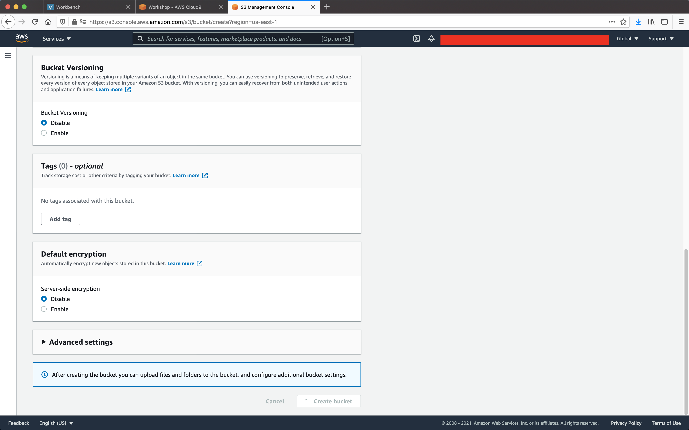
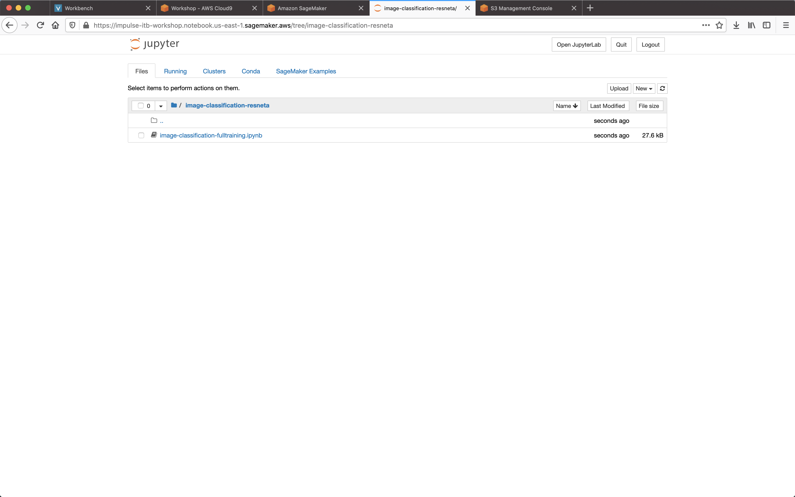

# Workshop Image Recognition Menggunakan Amazon SageMaker

## 1. Persiapan

Di bagian ini kita akan melakukan persiapan yakni membuat sumber daya yang dibutuhkan dalam menjalankan algoritma Image Recognition menggunakan Amazon SageMaker. Sumber daya ini antara lain adalah S3 Bucket dan SageMaker Notebook. 

### 1. a. Membuka AWS Console dari AWS Educate

Sebelum membuat sumber daya yang dibutuhkan, Anda perlu masuk ke AWS Console lewat AWS Educate.

**LANGKAH 1** Buka AWS Educate account Anda. Klik **AWS Console**.

**LANGKAH 2** Sekarang Anda berada dalam halaman AWS Console.

### 1. b. Membuat S3 Bucket

Sekarang Anda akan membuat S3 Bucket yang akan digunakan untuk menyimpan data _training_, data _test_, dan juga model.

**LANGKAH 1** Dari AWS Console, buka S3 Console dengan mencari S3 di input pencarian di bagian atas AWS Console.

**LANGKAH 2** Sekarang Anda berada di S3 Console, klik tombol **Create Bucket**.

**LANGKAH 3** Di bagian form, input nama __bucket__ Anda. Nama ini unik untuk semua pengguna AWS, jadinya pilih nama yang seunik mungkin. Sebagai contoh masukkan `impulse-workshop-<nama-anda>-<angkarandom>`. Pilih `us-east-1` untuk Region. Klik tombol **Create Bucket** di bagian bawah setelah selesai.

**LANGKAH 4** Sekarang Anda bisa melihat __bucket__ Anda sudah dibuat.

### 1. c. Membuat SageMaker Notebook

Sekarang kita akan membuat SageMaker Notebook untuk mengimplementasikan algoritma image recognition.

**LANGKAH 1** Dari AWS Console, buka SageMaker console dengan mencari SageMaker di bagian input pencarian atau akses [link ini](https://console.aws.amazon.com/sagemaker/home).

 

**LANGKAH 2** Sekarang Anda sudah ada di SageMaker Console. Klik **Notebook Instances**.

 

**LANGKAH 3** Di bagian ini, klik tombol **Create notebook instance**.

**LANGKAH 4** Pada **Notebook instance name** masukkan nama yang Anda pilih. Kemudian di bagian **Notebook instance type** pilih `ml.t2.medium`.

**LANGKAH 5** Pada bagian **IAM Role** pilih create **create new IAM Role**. Lalu di bagian **Specific S3 Buckets**, masukkan nama __bucket__ yang sudah Anda buat di Langkah sebelum ini. Klik **Create Role** untuk melanjutkan.

**LANGKAH 6** Biarkan pilihan yang lain, kemudian klik tombol **Create notebook instance**

**LANGKAH 7** Anda akan kembalik ke halaman daftar notebook. Notebook yang dibuat sudah dapat terlihat. Tunggu hingga statusnya **InService**.

## 2. Membuat Image Classification Menggunakan Amazon Sagemaker Built-in Resnet Algorithm.

Di bagian ini kita akan melakukan implementasi algoritma image classification dengan menggunakan Amazon SageMaker dengan data [Caltech-256](https://authors.library.caltech.edu/7694/) yakni data berisi 256 benda dari total 30 ribu gambar.

**LANGKAH 1** Unduh notebook [`image-classification-fulltraining.ipynb`](res/image-classification-fulltraining.ipynb).

**LANGKAH 2** Dari konsol Notebook instances, buka Jupyter Notebook dari instans yang sudah kita buat di atas. Pilih **Open Jupyter**.

**LANGKAH 2** Sekarang Anda sudah berada di dalam Jupyter notebook instance. Unggah notebook `image-classification-fulltraining.ipynb` yang sudah Anda unduh ke notebook tersebut dengan mengklik **Upload** dan memilih file.

**LANGKAH 3** Sekarang Anda sudah berada di Jupyter notebook berisi langkah dan algoritma image recognition. Ikuti langkah-langkah yang ada di notebook tersebut. Klik tombol **Run** untuk merunut setiap langkah.

### 3. Melakukan Pembersihan

Setelah Anda berhasil menjalankan algoritma, sekarang saatnya membersihkan semua sumber daya yang tidak dibutuhkan agar tidak menimbulkan biaya yang percuma.

### 3. a. Menghapus Notebook SageMaker

**LANGKAH 1** Pergi ke halaman Notebook instance di SageMaker console. 

**LANGKAH 2** Pilih instans yg ingin dimatikan, kemudian pilih **Actions** > **Stop**.

**LANGKAH 3** Setelah instans sudah dalam Status **Stopped**, pilih **Actions** > **Delete**. Lalu konfirmasi penghapusan.

### 3. b. Menghapus S3 Bucket

**LANGKAH 1** Di halaman konsol S3, pilih __bucket__ yang ingin dihapus. Lalu pilih **Empty**. __Bucket__ harus kosong sebelum bisa dihapus. Lalu konfirmasi pengosongan __bucket__.

**LANGKAH 2** Setelah itu pilih **Delete** pada __bucket__ yang ingin dihapus. Dan konfirmasi penghapusan.
